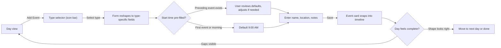
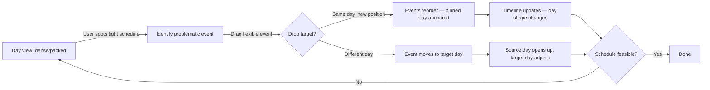

```mermaid
graph LR
    A["Trip List"] -->|"Create Trip"| B["Trip Form: name, destination, dates"]
    B -->|"Save"| C["Trip Timeline: empty days visible"]
    C -->|"User sees skeleton"| D["Tap day / Add Event"]
    D --> E["Type selector: Flight selected"]
    E --> F["Flight form: airline, number, airports, times"]
    F -->|"Mark as Pinned"| G["Event saved — lock icon visible"]
    G -->|"Repeat for hotel, return flight"| H["Timeline shows anchors across days"]
    H --> I["User sees trip skeleton — ready to fill"]
```

# UX Design Specification traccia

**Author:** Simo
**Date:** 2026-02-11

---

<!-- UX design content will be appended sequentially through collaborative workflow steps -->

## Executive Summary

### Project Vision

traccia is a planning logistics layer for travelers — not a booking tool, not an AI generator. It fills the gap between "I've booked my flights and hotel" and "I know what I'm doing each day." Users bring their own bookings and intentions; traccia organizes them into a realistic, executable timeline.

Built with Go, HTMX, templ, Tailwind CSS, and Alpine.js — a server-side rendered stack with no SPA framework. The interface delivers HTML fragments via HTMX partial updates, with Alpine.js handling lightweight client-side interactions (drag-and-drop, modals, form defaults). daisyUI v5 provides the component foundation as a Tailwind v4 CSS plugin (semantic classes: btn, card, badge, modal, drawer, tabs, toast, etc.). Custom templ components are built for traccia-specific UI.

Core design principles:
- *"The plan is disposable, the traveler is sovereign."*
- *"The traveler is the sensor, the app is the calculator."*
- *Buffers are calculated consequences, not explicit entities.*

### Target Users

- **Sarah, the Anxious Planner (Primary):** The trip architect who views travel as a high-stakes investment. Fears the "Domino Effect" — one missed connection cascading into chaos. Uses traccia to build certainty. Success moment: holding a printed Survival Export in a taxi, stress-free.
- **David, the Pragmatic Maximizer (Primary):** Time-poor explorer who hates dead time. Wants to see the shape of each day at a glance, spot gaps, and fill them in minutes. Success moment: adding three events to a free afternoon and heading out with confidence.
- **Ben, the Reluctant Companion (Secondary, Phase 2):** Consumes the plan passively via shared link or printed PDF. Never installs anything, never creates an account.

### Key Design Challenges

- **Event duration representation:** The proportional-height model (64px/hr) from Epic 1 caused unreadable short events and wastefully tall long events. This concept is open for rethinking — options include non-linear "noticeable difference" scaling, fixed-height cards with a separate duration indicator, or discrete size tiers. The solution must work across 15-minute transfers and 12-hour flights.
- **Manual entry efficiency:** No email parsing in MVP. Five event types with type-specific fields create form complexity that must feel frictionless, not burdensome.
- **Timeline density at a glance:** Users need to see "day 3 is packed, day 4 is light" without drilling in. The visual mechanism for communicating day-level shape and pace is a core UX problem.
- **Pinned vs. flexible clarity:** Immovable anchors and moveable events must be instantly distinguishable, especially during drag-and-drop reordering.
- **Print design for Survival Export (Phase 1.5):** A4 paper constraints — legibility, ink efficiency, QR code sizing, information density — require a separate design treatment from screen UI.

### Design Opportunities

- **"Shape of the day" as core differentiator:** If the timeline communicates density, pace, and gaps at a glance better than any competitor, that's the product's UX moat.
- **Type-specific visual identity:** Five event types with distinct visual signatures (icon, color accent, card treatment) enabling instant scanning of a day's composition.
- **Swiss/Brutalist aesthetic foundation:** High contrast, bold borders, semantic signal colors, "function is the aesthetic." Distinctive in a space dominated by soft, rounded travel app aesthetics. To be evolved from previous UX exploration.
- **Progressive disclosure:** Compact day overview for scanning, drill-down for details — maps to Sarah's "scan then verify" and David's "spot the gap, fill it" workflows.

## Core User Experience

### Defining Experience

The core interaction is **"Place-First Capture"** — the user starts with *where* they want to go, not *when*. The place anchors the event; time and logistics flow from it.

The primary loop: **Search place -> Select type -> Confirm defaults -> Event snaps into timeline**. In MVP (without place search API), this degrades gracefully to manual entry with type-specific form reshaping. The UX is designed for the search-first flow from day one — MVP is a stepping stone, not the target interaction model.

The foundational action is **adding an event to a day**. If this feels clunky, nothing else matters — the user never reaches a complete timeline, never tries reordering, never generates an export. Event creation is the gateway to all downstream value.

### Platform Strategy

- **Primary context:** Desktop web — the "planning desk." Full layout with timeline and room for a future map pane. Planning sessions are deliberate, focused work.
- **Secondary context:** Mobile web (375px+) — the "field reference." Quick checks ("what's next?"), light edits, and on-trip use. Single-column layout.
- **MVP layout:** Timeline-only. The layout should be architected to accommodate a map pane in future phases (split view on desktop) without requiring a redesign.
- **No offline mode.** HTMX is server-dependent by design. Offline access is solved by the Survival Export (PDF), not by PWA/service worker complexity.
- **Breakpoint:** 768px as the mobile/desktop threshold.
- **Input mode:** Mouse/keyboard primary (desktop planning), touch secondary (mobile reference). Drag-and-drop must work on both.

### Effortless Interactions

- **Smart defaults eliminate blank fields.** When a user selects an event type, the form reshapes to show only relevant fields with sensible defaults: start time from preceding event's end, end time from type-based duration (Food ~1.5hr, Activity ~2hr, Transit ~30min, Lodging overnight), day from current view context.
- **Type-specific form morphing.** Selecting "Flight" surfaces airline, flight number, terminals, origin/destination. Selecting "Activity" surfaces location, duration, notes. The user never sees irrelevant fields.
- **Context-inherited day assignment.** Adding an event from Day 3's view pre-selects Day 3. No redundant date picker interaction.
- **Position auto-placement.** New events slot at the end of the current day's timeline or after the selected event. The timeline updates instantly.
- **Place search as the future primary input (post-MVP).** The search bar becomes the entry point for event creation — type a place name, select from autocomplete, and the location/address/coordinates are populated automatically. Manual entry remains as fallback for unlisted locations.

### Critical Success Moments

1. **The First Event:** The user adds their first event and sees it appear in the timeline. The day goes from empty to having shape. If this feels slow or confusing, they abandon.
2. **The Second Event Snap:** Adding a second event reveals the day's structure — sequence, gaps, and time flow become visible. The user sees the timeline as a planning tool, not just a list.
3. **The Packed Day Realization:** Looking at a day with 6+ events, the user instantly sees it's too dense — without the app telling them. The visual density communicates "this day is impossible" naturally.
4. **The Drag-and-Resolve:** The user drags a flexible event past a pinned anchor and sees it land in the right position. Pinned events stay put. The system "gets it."
5. **The Survival Export (Phase 1.5):** Generating the PDF and seeing addresses, times, and QR codes formatted for paper. The transition from "digital plan" to "physical safety net."

### Experience Principles

1. **Place before time.** The user thinks in destinations, not timestamps. The system translates places into schedule logistics.
2. **Defaults over blank fields.** Every form element has a sensible default derived from context (event type, preceding events, current day). The user confirms or adjusts — never fills from zero.
3. **The timeline is the product.** All value is visible in the timeline. It's not a feature of the app — it is the app. Every interaction either builds the timeline or reads from it.
4. **Show, don't tell.** Dense days look dense. Gaps look empty. Pinned events look anchored. The visual representation communicates state without labels, badges, or warnings.

## Desired Emotional Response

### Primary Emotional Goals

- **Certainty (Sarah's north star):** Replace travel anxiety with logistical confidence. The user trusts the timeline because it shows her the truth — what fits, what doesn't, what's pinned, what's flexible. The system earns trust by being accurate, not by telling her to trust it.
- **Efficiency satisfaction (David's north star):** The feeling of "I just planned a full day in 3 minutes." Speed and decisiveness, not browsing and deliberating. The tool respects his time by doing the math so he doesn't have to.
- **Quiet competence:** The product feels like a reliable tool, not a needy assistant. It doesn't demand attention, celebrate trivially, or use exclamation marks. It supports action and gets out of the way.

### Emotional Journey Mapping

- **First visit:** *Curiosity → Orientation.* The user sees an empty trip and understands immediately what to do — add the first event. No tutorial, no onboarding wizard. The empty state guides.
- **Planning session:** *Building momentum → Satisfaction.* Each event added makes the day more complete. The timeline fills in and the user sees the trip taking shape. The feeling is "solving a puzzle" — productive, focused, slightly addictive.
- **Spotting a problem:** *Concern → Resolution.* The timeline visually hints that something is off (a tight connection, a packed day). A playful, travel-aware message provides context ("That's a sprint between Shibuya and Asakusa — maybe shuffle things around?"). The user fixes it and the visual hint disappears. Relief.
- **Completing a day:** *Accomplishment.* A day with a coherent shape — morning to evening, no impossible gaps — feels done. A subtle visual signal confirms the day is solid.
- **Generating the export (Phase 1.5):** *Security.* The transition from digital plan to physical artifact. Holding the PDF is the emotional payoff for Sarah — "I'm ready."
- **Returning:** *Familiarity.* The tool is exactly where they left it. No re-learning, no "what's new" modals. Pick up and continue.

### Micro-Emotions

- **Confidence over confusion:** Every interaction has a clear outcome. The user never wonders "did that work?" — events snap into place, forms close, the timeline updates.
- **Trust over skepticism:** Auto-suggested times are sensible. Type-specific defaults are accurate. The system demonstrates competence through correct defaults, not through claims.
- **Calm over alarm:** Problems are communicated visually and contextually, not through modal alerts or red banners. The tone is "here's something to consider" not "ERROR."
- **Accomplishment over tedium:** The ratio of user input to visible result is high. One event added = visible change in the day's shape. The user feels productive, not burdened by data entry.

### Design Implications

- **Meaningful micro-animations only.** An event snapping into the timeline, a visual hint fading when resolved, a day's density subtly shifting — these convey information. No decorative animations, no confetti, no loading spinners that exist just to show "something is happening."
- **Travel-aware voice for messages.** When the system communicates (error states, hints, empty states), the tone is warm and contextual. It references the trip, not the software. "Day 3 is looking packed — might want to move the shrine visit" instead of "Schedule conflict detected."
- **Dual feedback for problems.** Visual hint on the timeline (a color shift, an icon, a density indicator) plus a contextual message. Neither alone is sufficient — the visual catches the eye, the message explains.
- **Earned satisfaction moments.** Subtle visual signals when meaningful milestones occur: first event added, a day fully planned, an export generated. These are informational ("this day is complete") not celebratory ("great job!").
- **No false alarms.** Warnings and hints must be accurate. A single false positive ("this connection is tight" when it's actually fine) destroys trust permanently. Better to under-warn than over-warn.

### Emotional Design Principles

1. **The tool is serious, the context is joyful.** traccia is a reliable planning instrument, but it's planning *trips* — vacations, adventures, experiences. The voice can be warm and travel-aware without being frivolous.
2. **Feedback is information, not decoration.** Every visual change, animation, or message communicates state. If it doesn't convey meaning, it doesn't exist.
3. **Calm authority.** The product doesn't shout, beg, or celebrate. It presents the truth clearly and lets the user decide. Problems are shown, not announced.
4. **Trust is built by being right.** Defaults that match expectations, time suggestions that make sense, visual density that accurately reflects reality. Trust comes from competence, not from saying "trust us."

## UX Pattern Analysis & Inspiration

### Inspiring Products Analysis

**Linear (Project Management)**
- *Core strength:* Extreme information density that feels calm, not cluttered. Every pixel serves a purpose. The list view shows status, assignee, priority, and labels without needing to open each item.
- *Key lesson:* Type-specific visual indicators (bug icon, feature icon, task icon) enable instant scanning of a mixed-type list — directly relevant to traccia's five event types in a timeline.
- *Relevant patterns:* Keyboard-first navigation, inline editing, contextual menus that appear on hover, status indicators as small colored dots rather than large badges.
- *Aesthetic alignment:* Monochrome with functional color. Borders and spacing create hierarchy, not decoration. Close to the Swiss/Brutalist direction.

**Notion (Knowledge Management)**
- *Core strength:* Block-based architecture where different content types have distinct visual treatments but coexist naturally. A page can contain text, tables, callouts, and embeds — each visually distinct, all feeling cohesive.
- *Key lesson:* Progressive disclosure through expandable blocks. The overview is scannable; details are one click deep. Empty states are inviting ("Add a page...") rather than blank voids.
- *Relevant patterns:* Type-specific block rendering (traccia's event types as distinct "blocks" in a timeline), slash-command for quick type selection, drag-and-drop reordering of blocks.
- *Aesthetic alignment:* Clean whitespace, subtle borders, type-driven hierarchy.

**Google Calendar (Time Management)**
- *Core strength:* Time is space. A 3-hour event takes 3x the vertical space of a 1-hour event. Overlaps are visually obvious. Packed days look packed; empty days look empty. The visual density IS the information.
- *Key lesson:* The "shape of the day" is communicated without any labels or metrics — you just see it. This is the strongest validation of traccia's core UX goal, but the proportional-height model needs adaptation (as discussed — non-linear or tiered rather than strict 1:1).
- *Relevant patterns:* Color-coded event categories, drag-to-reschedule, click-empty-space-to-create. The day/week view toggle for different levels of detail.
- *Caution:* Calendar works because most events are 30min–2hr. Travel events span 15min (transfer) to 12hr (flight) — the range is much wider, which is why strict proportional height broke in Epic 1.

**Flighty (Flight Tracking)**
- *Core strength:* A travel app that treats information design as a first-class concern. Flight status, gate changes, delays, and terminal maps are presented with Swiss-design clarity — high contrast, tabular numerals, monospace data, beautiful on screen and in screenshots.
- *Key lesson:* Travel data can look authoritative and beautiful simultaneously. The "Field Guide" aesthetic traccia is pursuing has a real-world validation in Flighty. Dense information doesn't need to feel overwhelming — it needs hierarchy and typography.
- *Relevant patterns:* Timeline visualization of a flight's progress, clear status indicators (on time / delayed / cancelled), information density that respects the user's intelligence. Print-worthy layouts.
- *Aesthetic alignment:* The closest existing product to traccia's Swiss/Brutalist direction. Dark backgrounds with high-contrast data, monospace for times and codes, semantic color for status.

### Transferable UX Patterns

**Information Scanning (from Linear)**
- Small, consistent type indicators (icon + color accent) on every event card so the user can scan a day's composition without reading text. "I see two food events, one transit, and three activities" at a glance.
- Contextual actions on hover/tap rather than always-visible buttons, keeping the timeline clean.

**Progressive Disclosure (from Notion)**
- Compact event cards in the timeline showing name, time, and type indicator. Expand/drill-down reveals full details (address, notes, booking reference, type-specific fields). The overview is never cluttered with details.
- Inviting empty states: an empty day shows a clear prompt to add the first event, not a blank void.

**Day Shape Communication (from Google Calendar)**
- The visual representation of a day communicates density and pace without explicit metrics. Adapted for traccia: instead of strict proportional height, use a combination of card count, spacing, and subtle size variation to show "packed" vs. "light" days.
- Color-coded event types for instant visual parsing of a day's composition.

**Information Authority (from Flighty)**
- Tabular numerals for all time displays — times align vertically in the timeline, creating visual order.
- Monospace or semi-monospace treatment for structured data (flight numbers, booking references, addresses) to distinguish "data" from "prose."
- High-contrast typography hierarchy: place name dominates, time is secondary but always visible, metadata is tertiary.

### Anti-Patterns to Avoid

- **The "Content Firehose" (Wanderlog/TripAdvisor):** Bombarding users with "Top 10" lists, ads, recommendations, and social content. Traccia is a planning tool — the user edits, not browses.
- **The "Hidden Edit" (generic travel apps):** Burying time editing behind 3+ clicks (tap card → menu → edit → time → save). Rescheduling is a core loop — it must be drag-and-drop or single-interaction.
- **The "Modal Overload" (enterprise SaaS):** Every action requiring a full-screen modal with a form. Event creation should be lightweight — a compact inline form or slide-out panel, not a page transition.
- **The "Flat List" (basic to-do apps):** Treating all events as identical rows. If a flight looks the same as a coffee stop, the timeline loses its ability to communicate the day's structure.
- **The "Decorative Dashboard" (travel startups):** Animated counters, gradient backgrounds, hero images of destinations. These add visual noise without functional value and conflict with the "calm authority" emotional goal.

### Design Inspiration Strategy

**Adopt:**
- Linear's type-indicator system — small, consistent visual markers for event types enabling rapid scanning
- Notion's progressive disclosure — compact overview with expandable detail, inviting empty states
- Flighty's information authority — tabular numerals, typographic hierarchy, data-as-design
- Google Calendar's "visual density = information" principle — adapted for travel event ranges

**Adapt:**
- Google Calendar's time-as-space — move from strict proportional height to a "noticeable difference" model (non-linear scaling or discrete tiers) that works across 15min–12hr events
- Linear's keyboard navigation — adopt for desktop power users, but ensure touch works equally well for mobile
- Notion's drag-and-drop — adapt for timeline reordering with pinned-event constraints

**Avoid:**
- Wanderlog's visual clutter and content-first approach — traccia is editing-first
- Generic travel app aesthetics (soft gradients, rounded everything, pastel) — the Swiss/Brutalist direction differentiates
- Any pattern that requires complex client-side state management — HTMX architecture means server-rendered interactions

## Design System Foundation

### Design System Choice

**Tailwind CSS + daisyUI v5** — a Tailwind v4 CSS plugin that provides 65 semantic component classes (btn, card, badge, modal, drawer, tabs, toast, skeleton, divider, input, fieldset, etc.) with no runtime JS dependency. Custom templ components are built for traccia-specific UI (timeline, event cards, day views) using the same Tailwind utilities and daisyUI design tokens.

### Rationale for Selection

- **Tailwind v4 native:** daisyUI v5 is built specifically for Tailwind v4's CSS-first configuration model. A single `@plugin "daisyui"` directive in input.css activates all components — no Go library required.
- **No class-conflict concerns:** daisyUI uses semantic class names (`btn`, `card`, `badge`) rather than composing utility overrides, eliminating the need for a tailwind-merge resolver.
- **Covers standard UI needs:** Buttons, inputs, modals, toasts, drawers (sheet panels), tabs, alerts, tooltips, dropdowns — all provided as CSS classes usable in any templ template.
- **Themeable via CSS custom properties:** daisyUI v5 exposes `--color-primary`, `--color-base-100`, etc. The Swiss/Brutalist direction is applied by overriding these variables in input.css alongside the existing `--color-brand` tokens.
- **Maintained and widely used:** daisyUI is the most popular Tailwind component library. v5 actively targets Tailwind v4.

### Implementation Approach

- **No JS runtime:** Most daisyUI components are pure CSS (btn, card, badge, skeleton, divider, tabs). Interactive components (modal, drawer, toast) use the native `<dialog>` element or checkbox-driven patterns — wired via small `hx-on` attributes or Alpine.js where needed.
- **Theme layer:** Override daisyUI's CSS variables in input.css to implement the Swiss/Brutalist direction — high-contrast colors, semantic signal palette, typographic hierarchy. Custom `--color-brand`, `--color-success`, `--color-warning`, `--color-danger` tokens already defined.
- **Custom component convention:** Project-specific components (TimelineDay, EventCard, DayOverview) are templ functions accepting typed props, using Tailwind utilities and daisyUI classes for styling, HTMX attributes for server interaction.
- **Print stylesheet:** Tailwind's `print:` modifiers handle Survival Export styling. daisyUI components get print-specific overrides in the same CSS file if needed.

### Customization Strategy

**Theme overrides (CSS custom properties):**
- Neutral palette: high-contrast slate/white base matching Swiss design (override daisyUI base colors)
- Semantic signal colors: `signal-safe` (emerald), `signal-warn` (amber), `signal-risk` (rose) — reserved strictly for logistical status
- Brand accent: a single accent color (indigo or similar) for primary actions, used sparingly
- Dark mode: deferred — not an MVP concern, but templui supports it natively when ready

**Typography:**
- Primary typeface: Inter (or system sans-serif) — high legibility, neutral, tabular numeral support
- Monospace accent: for structured data (times, flight numbers, booking references)
- Tabular numerals (`font-variant-numeric: tabular-nums`) mandatory on all time displays

**Component customization:**
- templui components used as-is for standard UI (forms, modals, toasts, navigation)
- Borders, shadows, and spacing adjusted to match Swiss/Brutalist direction (thicker borders, harder shadows where appropriate)
- Custom components built for traccia-specific needs: event cards, timeline stream, day overview, signal indicators

## Defining Experience

### The Defining Interaction

traccia's defining experience is **"Place-First Capture"** — the user names where they want to go, and the system handles the rest. If we describe it to a friend: "You search for a place, it figures out what kind of event it is, suggests a time, and slots it into your day."

This is the interaction that, if nailed, makes everything else follow. A user who can add events effortlessly will build a complete day, see its shape, reorder it, and eventually export it. A user who struggles to add the first event will never reach any of that.

### User Mental Model

- **Current state:** Users have a spreadsheet (Sarah) or a mental list (David). The mental model is a flat table — rows of "Place | Time | Notes." It's familiar but tells them nothing about the day's shape, feasibility, or pace.
- **Traccia's shift:** From table to timeline. The same data (events with times and places) presented as a visual flow — morning to evening, with type-specific styling, density, and gaps visible at a glance.
- **The bridge:** Event creation must feel as fast as typing a spreadsheet row. The timeline payoff (visual shape, density, gaps) is the reward that justifies learning a new tool. If event creation is slower than a spreadsheet, the user goes back to Sheets.

### Success Criteria

- **Speed:** Adding an event with default acceptance takes under 10 seconds. The target flow (post-MVP with type inference) should take under 5 seconds.
- **Accuracy of defaults:** Auto-suggested start times, type-based durations, and (post-MVP) inferred event types match user intent at least 80% of the time. Wrong defaults are worse than no defaults — they erode trust.
- **Visual payoff:** After adding 2-3 events, the user sees the day take shape and understands the timeline as a planning tool. This is the "aha moment."
- **Zero dead ends:** Every state has a clear next action. Empty day → "Add your first event." One event → suggested start time for the next. Full day → density is visible, reordering is possible.

### Novel UX Patterns

**Established patterns used:**
- Form-based event creation (familiar from any CRUD app)
- Drag-and-drop reordering (familiar from Trello, Notion, calendars)
- Type-specific form fields (familiar from issue trackers like Linear)
- Progressive disclosure / expand-to-edit (familiar from Notion blocks)

**Novel combination:**
- **Type inference from place search (post-MVP):** Search results carry enough context (place category, Google Places type) to infer event type automatically. "Hilton Shinjuku" → Lodging. "Ichiran Ramen" → Food. "Tokyo Station" → Transit. The user confirms or overrides. This eliminates an explicit selection step and makes the Place-First Capture truly place-first.
- **Timeline as visual feedback loop:** The timeline isn't just a display — it's the feedback mechanism for every action. Add an event, see the day change. Drag an event, see the sequence update. The timeline IS the confirmation.

### Experience Mechanics

**MVP Flow (manual type selection):**

1. **Initiation:** User clicks "Add event" within a day view. Day context is inherited automatically.
2. **Type selection:** Compact selector (icon bar or segmented control) — Activity, Food, Lodging, Transit, Flight. Form reshapes immediately on selection.
3. **Place input:** Text field for name + address (manual entry).
4. **Time defaults:** Start time pre-filled from preceding event's end time. End time calculated from type-based duration (Food ~1.5hr, Activity ~2hr, Transit ~30min, Lodging overnight, Flight from input). User adjusts if needed.
5. **Confirm:** Single action (button or keyboard shortcut). Event appears in the timeline.
6. **Visual feedback:** Event card snaps into position with type-specific styling. Day density updates.

**Target Flow (post-MVP with place search + type inference):**

1. **Initiation:** User clicks the search bar / "Add event" within a day view.
2. **Place search:** User types a place name. Autocomplete returns results with location data.
3. **Selection + inference:** User selects a result. System infers event type from place category (restaurant → Food, hotel → Lodging, station → Transit, museum → Activity). Type indicator appears with an override option.
4. **Time defaults:** Same as MVP — pre-filled from context.
5. **Confirm:** Single action. Location, address, coordinates, and type all populated from the search result.
6. **Visual feedback:** Same as MVP.

**Error / edge cases:**
- **Type inference wrong:** User overrides with a single tap on the type selector. No penalty, no extra steps beyond what MVP requires.
- **Place not in search:** Manual entry fallback — text fields for name and address, explicit type selection. Same as MVP flow.
- **No preceding event:** Start time defaults to a sensible morning time (e.g., 9:00 AM) or trip-context-appropriate time.
- **Pinned event creation:** User toggles "pinned" during creation. The event locks to its specified time and won't move during reordering.

## Visual Design Foundation

### Color System

**Palette concept: "Swiss Signal System"** — a neutral, high-contrast base with strict semantic color reservations. Color is never decorative; it always means something.

**Brand accent:**
- `brand-primary`: `#008080` (teal) — actions, buttons, links, active states, focus rings
- `brand-primary-dark`: `~#006d6d` — small text links and inline references (WCAG AA compliant on white)
- `brand-primary-light`: `~#e0f2f1` — subtle background highlights, hover states on light surfaces

**Neutral base:**
- `bg-canvas`: slate-50 (`#f8fafc`) — app background, reduces eye strain vs. pure white
- `bg-surface`: white (`#ffffff`) — cards, panels, modals — creates depth against canvas
- `bg-surface-secondary`: slate-100 (`#f1f5f9`) — secondary surfaces, alternating rows, grouped areas
- `border-default`: slate-200 (`#e2e8f0`) — standard borders; slate-300 for emphasized borders
- `text-primary`: slate-900 (`#0f172a`) — maximum contrast for body text and headings
- `text-secondary`: slate-500 (`#64748b`) — metadata, labels, timestamps
- `text-tertiary`: slate-400 (`#94a3b8`) — placeholders, disabled states

**Semantic signals (reserved for logistical status only):**
- `signal-safe`: emerald-600 (`#059669`) — valid connections, feasible schedules, confirmed items
- `signal-warn`: amber-500 (`#f59e0b`) — tight buffers, dense days, items needing attention
- `signal-risk`: rose-600 (`#e11d48`) — impossible connections, missing critical data, conflicts

**Rules:**
- Signal colors are NEVER used for decoration, branding, or non-status purposes. Their semantic power depends on scarcity.
- The brand teal is NEVER used for status indication — it's always an action/navigation color.
- All signal states pair color with an icon to support color-blind users.

### Typography System

**Primary typeface: Inter** (via Google Fonts or system font stack fallback)
- Rationale: Highest legibility at small sizes, neutral "International Style" character, native tabular numeral support, excellent Tailwind integration.
- Fallback: `-apple-system, BlinkMacSystemFont, 'Segoe UI', sans-serif`

**Monospace accent: JetBrains Mono** (or system monospace fallback)
- Used for: flight numbers, booking references, confirmation codes, addresses
- Rationale: distinguishes "data" from "prose" at a glance; supports the Swiss information-design aesthetic

**Type scale (Tailwind classes):**
- `text-2xl` (1.5rem) — trip titles, page headings. Used sparingly.
- `text-xl` (1.25rem) — day headings ("Day 3 — Wednesday, May 14")
- `text-lg` (1.125rem) — section headers within views
- `text-base` (1rem) — body text, form inputs, event names
- `text-sm` (0.875rem) — timeline details, event metadata, secondary information
- `text-xs` (0.75rem) — timestamps, labels, badges

**Typography rules:**
- `font-variant-numeric: tabular-nums` mandatory on all time displays — ensures vertical alignment in timeline views
- Event names: `text-base font-semibold` — the dominant element on every card
- Times: `text-sm tabular-nums text-secondary` — always visible, never dominant
- Structured data (flight numbers, booking refs): monospace, `text-sm`
- Line height: `leading-snug` (1.375) for body text, `leading-tight` (1.25) for headings

### Spacing & Layout Foundation

**Base unit: 4px** (Tailwind standard). All spacing derives from this base.

**Density: spacious and calm** — prioritizing clarity and breathing room over maximum data density. The product should feel like a well-set page, not a packed dashboard.

**Card spacing:**
- Card padding: `p-4` (16px) — generous internal breathing room
- Card gap (between events in timeline): `gap-3` (12px)
- Section padding: `p-6` (24px) — day sections, view containers

**Layout structure:**
- **Desktop (≥768px):** Single main column for MVP (timeline). Max-width container (~800px) centered, leaving room for a future map pane on the right without redesigning. The layout uses CSS Grid so a second column can be added non-destructively.
- **Mobile (<768px):** Single column, full-width. Cards stack vertically with consistent spacing.
- **Future split view (post-MVP):** `grid-cols-1 md:grid-cols-[minmax(400px,1fr)_1fr]` — timeline takes at least 400px, map fills remaining space.

**Layout principles:**
- Generous whitespace between days — each day is a distinct visual section, not a continuous scroll of cards
- Consistent left alignment — the timeline reads top-to-bottom, left-to-right. No centered layouts, no card grids.
- Horizontal space is for breathing, not for filling. A narrow, well-spaced timeline is better than a wide, crowded one.

### Accessibility Considerations

**Contrast:**
- All body text (`text-primary` on `bg-surface`): 15.4:1 — exceeds AAA
- Secondary text (`text-secondary` on `bg-surface`): 4.6:1 — meets AA
- Brand teal (`#008080` on white): 4.4:1 — AA for large text and UI components; use `brand-primary-dark` for small text
- Signal colors on white: all meet AA for large text; paired with icons so color is never the sole indicator

**Color independence:**
- All signal states (safe/warn/risk) use icon + color, never color alone
- Event types distinguished by icon + label, not just color accent
- Interactive elements have visible focus rings (`ring-2 ring-brand-primary ring-offset-2`)

**Interaction targets:**
- Minimum 44x44px for all touch targets (buttons, event cards, drag handles)
- Keyboard navigation: timeline events navigable via Tab, expandable via Enter/Space
- Focus visible on all interactive elements

**Zoom and reflow:**
- Layout supports 200% text zoom without horizontal scrolling
- Timeline layout reflows gracefully — cards expand vertically, never get clipped

**Print:**
- Dedicated `@media print` styles: force black-on-white, remove background fills, increase contrast
- QR codes sized for reliable scanning from paper (minimum 2cm × 2cm)

## Design Direction

### Selected Direction: Swiss Bordered Cards

**Base:** Direction A — Swiss Bordered Cards with hard shadows, bordered cards, and teal accents. The most structurally explicit option, chosen for its clarity, scannability, and alignment with the "function is the aesthetic" principle.

### Timeline Spine

The vertical spine connects events into a chronological sequence — a visual metaphor for "time flows downward through your day." It provides structural continuity between cards, distinguishing the timeline from a flat list.

The original dot encoding (filled = pinned, hollow = flexible) is dropped — it required explanation, which means it failed as a visual signal. The spine serves purely as a visual connector. Pinned status is communicated through a lock icon on the card instead.

### Event Type Icons

Each event type gets an icon on a colored background — the primary mechanism for instant type recognition when scanning a day. The icon + color pairing must be immediately recognizable without a legend:

- **Activity:** general-purpose icon (e.g., compass, map pin) — teal background
- **Food:** fork/knife — warm-toned background
- **Lodging:** bed — cool-toned background
- **Transit:** vehicle/train — neutral-toned background
- **Flight:** plane — distinct-toned background

Specific icon selections and exact background colors are design system implementation details — the principle is that each type is visually distinct at icon + color level, readable at small sizes, and consistent across all views.

### Duration Representation

**MVP approach: fixed card height + written duration.** All event cards share a consistent height. Duration is communicated through the written time range (e.g., "9:00 AM - 11:30 AM") already present on every card. This avoids the problems from Epic 1 (proportional height causing unreadable short events and wasteful tall events) and keeps the layout predictable for drag-and-drop.

**Future consideration:** Tiered height scaling (3 discrete sizes: short/medium/long) may be revisited once real trip data validates whether visual duration feedback adds planning value beyond the written times. The written times may prove sufficient.

### Pinned Status

A lock icon in the card header replaces the text "PINNED" label. This is consistent with the icon-based language used for event types — compact, immediately understood, and visually coherent with the rest of the card anatomy.

### Card Anatomy Summary

```
+--[ Type Icon ]-- Event Name ----------- [ Lock icon if pinned ]--+
|                                                                   |
|  9:00 AM - 11:30 AM              Location / Address              |
|  [type-specific metadata line]                                    |
+-------------------------------------------------------------------+
```

- Hard shadow (2px offset, solid black or dark slate)
- 1px solid border (slate-300)
- Type icon with colored background (left of event name)
- Fixed card height across all types
- Teal accent for interactive/active states

### Design Direction Principles

1. **Borders are structure.** Every card, every section has explicit boundaries. No ambiguous floating elements.
2. **Color is semantic.** Teal for actions, type-specific colors for event icons, signal colors for status. Nothing decorative.
3. **Icons over labels.** Where a visual symbol is universally understood (lock, fork/knife, plane), prefer the icon. Reserve text for information that icons can't convey.
4. **Consistent card height for MVP.** Simplicity and drag-and-drop predictability over visual duration encoding. Revisit when real usage data is available.

## User Journey Flows

### Trip Setup & Anchor Laying

**Trigger:** User creates a new trip and lays down the fixed-time skeleton (flights, hotel).

**Flow:**



**Key interactions:**
- Trip creation is a single form (name, destination, date range). On save, the timeline renders all days immediately — the empty skeleton is the first "shape of the trip" moment.
- Anchor events (flights, hotel) are naturally pinned. The lock icon appears on save.
- After 2-3 anchors, the user sees which days have fixed points and which are open.

### Day Building (Core Planning Loop)

**Trigger:** User fills a day with events, watching it take shape. This is the core loop — the interaction users repeat most.

**Flow:**



**Key interactions:**
- "Add Event" lives within day context — day is auto-inherited, no date picker needed.
- Type selection is a compact icon bar (5 icons). Form morphs instantly on selection via Alpine.js.
- Start time auto-fill: preceding event's end time becomes the new event's start. User adjusts only if needed.
- After save, the card appears in-place (HTMX partial update). No page transition, no modal dismissal.
- The loop is tight: add → see result → decide if more → add again.

### Day Rebalancing

**Trigger:** User spots an overpacked or infeasible day and resolves it by moving events.

**Flow:**



**Key interactions:**
- The user recognizes the problem visually — card density and tight time gaps tell the story. No alert needed.
- Pinned events show lock icon and reject drag attempts. Flexible events flow around them.
- Cross-day moves: dragging to a different day's drop zone moves the event entirely. Both timelines update.
- Visual update must be < 100ms (NFR2). This is the most latency-sensitive interaction.

### Journey Patterns

**Navigation patterns:**
- **Day-as-context:** The active day determines defaults for all actions. No global "which day?" step.
- **Timeline-as-home:** The trip timeline is the single navigation root. All actions start from and return to it.

**Decision patterns:**
- **Type-first branching:** Selecting an event type reshapes the form. This is the one explicit decision; everything else flows from defaults.
- **Visual-before-verbal:** Users recognize problems from the timeline's visual density before reading text.

**Feedback patterns:**
- **In-place update:** Every action updates the timeline inline. No page transitions, no success modals. The timeline IS the confirmation.
- **Dual feedback for problems:** Visual hint on the timeline + contextual travel-aware message.

### Flow Optimization Principles

1. **Minimize steps to first value.** Trip creation → first event should take under 60 seconds.
2. **Keep the user in the timeline.** Event creation, editing, and reordering all happen within the timeline view. No navigation away.
3. **Leverage spatial memory.** Events positioned in days, days positioned in a trip. The user builds a mental map of the plan's layout.
4. **Fail gracefully, recover fast.** Failed drag snaps back. Form errors highlight the field without clearing others. Accidental delete recoverable via toast with undo.
5. **Progressive density.** Timeline starts sparse (anchors only) and densifies as events are added — skeleton first, details later.

## Component Strategy

### Design System Components (daisyUI v5)

daisyUI v5 provides 65 semantic component classes via `@plugin "daisyui"`. The following are directly usable for traccia's needs:

**Forms & Input:** `input`, `textarea`, `select`, `checkbox`, `radio`, `toggle`, `fieldset`, `label`, `floating-label`, `btn`, `calendar` — covers all trip and event CRUD forms.

**Feedback & Overlays:** `toast` (undo actions, travel-aware messages), `modal` via native `<dialog>` (delete confirmations), `alert` (system messages), `tooltip` (field hints).

**Navigation & Layout:** `tabs` (day switching within a trip — radio-input pattern, no JS), `breadcrumbs` (Trip List → Trip → Day), `menu` (app-level navigation), `drawer` (Sheet panel: event creation — right on desktop, bottom on mobile).

**Display:** `card` (base for EventCard), `badge` (event type labels, status pills), `skeleton` (HTMX loading placeholders), `divider` (visual dividers between days), `table` (trip list view).

**Interactive:** `collapse` (progressive disclosure on event cards), `dropdown` (event actions menu — edit, delete, pin/unpin).

### Custom Components

#### TimelineDay

**Purpose:** Container for a single day's events within the trip timeline. The structural backbone of the planning view.
**Anatomy:** Day heading ("Day 3 — Wednesday, May 14") + vertical spine + ordered EventCard slots + drop zones between cards + EmptyDayPrompt if no events.
**States:** Default (has events), empty (no events — shows prompt), drag-active (drop zones highlighted), collapsed (trip-level overview).
**Behavior:** Receives drag-and-drop events (both reorder within day and cross-day moves). Drop zones appear between existing cards during drag. HTMX swaps update the day's content after server-side reorder.
**Accessibility:** Day heading is a landmark (`role="region"` with `aria-label`). Event list is an ordered list. Drop zones announced to screen readers during drag.

#### EventCard

**Purpose:** The primary information unit — displays one event in the timeline with type-specific styling.
**Anatomy:** Type icon (colored background) | Event name | Lock icon (if pinned) | Time range | Location | Type-specific metadata line. Swiss-bordered: 1px solid border, 2px hard shadow.
**States:** Default, hover (subtle border highlight), dragging (elevated shadow, reduced opacity at source), drag-over (target highlight), editing (inline or panel), pinned (lock icon visible, drag disabled).
**Variants:** Five type variants (Activity, Food, Lodging, Transit, Flight) — same layout, different type icon and icon background color.
**Behavior:** Click/tap expands to show full details (progressive disclosure via Collapsible). Drag handle on left side initiates reorder. Context menu (Dropdown) for edit/delete/pin actions.
**Accessibility:** Each card is a list item with `aria-label` combining event name and time. Expand/collapse via Enter/Space. Drag-and-drop has keyboard alternative (move up/down via arrow keys with modifier).

#### TypeSelector

**Purpose:** Compact visual picker for the 5 event types. Triggers form morphing on selection.
**Anatomy:** Horizontal row of 5 icon buttons, each with the type's icon on its colored background. Selected type has a teal ring/border.
**States:** Default (no selection), selected (one type active with ring), hover (subtle scale or border).
**Behavior:** Single-select. On selection, emits an Alpine.js event that morphs the form below to show type-specific fields. In post-MVP with type inference, the selector pre-selects the inferred type with an override affordance.
**Accessibility:** `role="radiogroup"` with `role="radio"` on each option. Arrow keys navigate between types. Labels announce type name.

#### DragHandle

**Purpose:** Visual affordance indicating an event card can be dragged. Also serves as the drag initiation target.
**Anatomy:** Grip dots icon (6 dots in 2x3 grid) on the left edge of an EventCard.
**States:** Default (visible on hover/always on mobile), dragging (cursor changes), disabled (hidden on pinned events).
**Behavior:** Mouse down + move initiates drag. On pinned events, the handle is hidden and the card shows the lock icon instead — pinned cards cannot be dragged.
**Accessibility:** `aria-roledescription="sortable"`. Keyboard: focus on card, use Alt+Arrow Up/Down to reorder.

#### DayOverview

**Purpose:** Compact summary of a day for the trip-level timeline view. Enables "shape of the trip" scanning.
**Anatomy:** Day label ("Day 3 — Wed") + event count + time span (earliest start → latest end) + type composition icons (miniature type icons showing what's in the day).
**States:** Default, empty (no events — muted), dense (many events — visual indicator), active/selected (expanded to full TimelineDay).
**Behavior:** Click expands to full TimelineDay view. Provides at-a-glance trip scanning without drilling into each day.

#### EmptyDayPrompt

**Purpose:** Inviting empty state for days with no events. Guides new users and reduces the "blank canvas" problem.
**Anatomy:** Centered message ("Add your first event to Day 3") + "Add Event" button with teal accent.
**States:** Single state — appears only when a day has zero events.
**Behavior:** "Add Event" button triggers the same flow as the day-level add button (opens TypeSelector + form).

#### SignalIndicator (Post-MVP)

**Purpose:** Inline indicator for logistical status — tight connections, dense days, impossible timings.
**Anatomy:** Signal icon (checkmark/warning/alert) + colored dot (emerald/amber/rose) + short travel-aware message.
**States:** Safe ("Comfortable connection"), warn ("That's a sprint between Shibuya and Asakusa"), risk ("Not enough time — 15 min gap, 40 min travel").
**Behavior:** Appears between EventCards where a logistical concern exists. Dismissible if the user acknowledges. Recalculates when events are reordered.

### Component Implementation Strategy

- **daisyUI classes** are used for all standard UI: forms, modals, toasts, navigation, data display. Themed via CSS custom property overrides in input.css to match the Swiss/Brutalist direction.
- **Custom components** are built as templ functions with typed Go props, Tailwind utilities and daisyUI classes for styling, HTMX attributes for server-rendered updates.
- **Alpine.js** handles client-side state for TypeSelector form morphing and drag-and-drop (via SortableJS or a lightweight Alpine plugin). Interactive daisyUI components (modal, drawer) use native HTML patterns — `<dialog>.showModal()` or checkbox toggle — wired via Alpine.js or `hx-on` as needed.
- **Shared design tokens**: custom components use the same CSS variables as daisyUI (`--color-primary`, `--color-base-100`, etc.) plus traccia's signal color tokens, ensuring visual consistency.

### Implementation Roadmap

**Phase 1 — Core (MVP Sprint 1):**
- EventCard, TimelineDay, TypeSelector, EmptyDayPrompt
- These are required for the most basic journey: create trip → add events → see timeline
- Without these, no user flow can be tested

**Phase 1 — Core (MVP Sprint 2):**
- DragHandle, DayOverview
- Enables event reordering (the Day Rebalancing journey) and trip-level scanning
- Depends on EventCard and TimelineDay being stable

**Phase 2 — Enhancement:**
- SignalIndicator
- Requires logistics intelligence backend (FR29-FR30) — no point building the component before the data exists

## UX Consistency Patterns

### Button Hierarchy

**Primary (teal, solid):** One per view — the single most important action. "Create Trip," "Save Event," "Generate Export." Uses `brand-primary` background with white text.

**Secondary (teal, outline):** Supporting actions. "Add Event" within a day, "Edit," "Pin/Unpin." Teal border + teal text on white background.

**Destructive (rose, outline → solid on confirm):** "Delete Trip," "Delete Event." Always requires confirmation via Dialog or undo Toast. Rose border in default state; solid rose in the confirmation dialog's action button.

**Ghost (text only, slate):** Tertiary and cancel actions. "Cancel," "Close," "Back." Slate text, no border, no background. Hover shows subtle background.

**Rule:** No view has more than one primary button. If two actions compete for primary, one becomes secondary.

### Feedback Patterns

**Success — inline timeline update:** No success modal or banner. The timeline updating IS the success feedback. Event appears in place, reorder resolves visually, deletion removes the card. The visual change is the confirmation.

**Success — toast for non-visual actions:** Actions without a visible timeline change (trip settings saved, link copied) get a templui Toast. Auto-dismiss after 4 seconds. Factual tone: "Settings saved." No "Great job!" language.

**Undo — destructive toast:** Delete actions show a Toast with undo button. "Event removed. [Undo]" — 8-second window before permanent deletion. Undo restores the event in-place. This is the primary error recovery for accidental deletes — no "Are you sure?" for single events.

**Warning — dual signal (post-MVP):** SignalIndicator between EventCards (visual hint) + travel-aware message (verbal context). "That's a sprint between Shibuya and Asakusa — maybe shuffle things around?" Icon + amber color. Never color alone.

**Error — field-level validation:** Rose border on the specific field + inline error message below it. Other fields retain values. Message is specific: "End time must be after start time," not "Invalid input." No page-level error banners.

**Error — server/network:** Toast with rose accent. "Couldn't save — check your connection and try again." Includes retry button. Form retains all entered values — no data loss on failure.

### Form Patterns

**Progressive form morphing:** TypeSelector selection reshapes the form instantly. Only relevant fields appear for the selected type. Transition via Alpine.js `x-show` — instant, not animated. Speed over smoothness.

**Smart defaults:** Every field has a context-derived default:
- Day: inherited from current view context
- Start time: preceding event's end time (or 9:00 AM if first event)
- End time: start time + type-based duration (Food ~1.5hr, Activity ~2hr, Transit ~30min, Lodging overnight, Flight from input)
- Pinned: defaults to flexible (unchecked)

**Inline editing:** Event details are editable in-place within the expanded card. Click a field → edit → blur to save. HTMX `hx-patch` on blur for individual field updates. No "edit mode" toggle, no separate edit page.

**Form location:** Event creation uses a Sheet (slide-out panel from right on desktop, bottom sheet on mobile) — fresh context for a new event. Event editing is inline within the expanded EventCard — stays in the existing context.

### Navigation Patterns

**Three-level hierarchy:** Trip List → Trip Timeline → Day View. Navigated via Breadcrumb. The timeline is always one click from any state.

**Day switching:** Tabs along the top of the timeline. Active day has teal underline. Click scrolls/focuses that day. No full page reload — HTMX partial update or scroll-to-anchor.

**Back = up one level:** Browser back button and explicit back links both navigate up the hierarchy. No dead-end states anywhere in the app.

**Mobile:** Sidebar collapses to hamburger menu. Day tabs become a horizontal scrollable strip. Trip list is the landing page.

### Empty States & Loading

**Empty trip list:** "Plan your first trip" + primary button. This is the first thing a new user sees — warm and inviting, not blank.

**Empty day:** EmptyDayPrompt — "Add your first event to Day 3" + "Add Event" button. Positioned where events would appear, maintaining spatial consistency.

**Empty timeline (new trip):** All days show EmptyDayPrompt. Day headers are visible — the user sees the trip's date range and structure immediately. The skeleton of the trip is visible even before any events exist.

**Loading (HTMX):** Skeleton placeholders (templui Skeleton) in the exact shape of the incoming content. No spinners. Appears during HTMX swaps, disappears when HTML arrives. For sub-200ms responses, the skeleton may flash or not appear — acceptable.

### Modal & Overlay Patterns

**Sheet (slide-out panel):** Event creation. Slides from right on desktop, from bottom on mobile. Contains TypeSelector + form. Dismissible via Escape, click-outside, or close button.

**Dialog:** Destructive confirmations only. "Delete this trip? This will remove all events." Two buttons: "Cancel" (ghost) + "Delete" (destructive, rose). No dialogs for non-destructive actions.

**No modals for information.** Event details, trip settings, and all read-only content shown inline or in expandable sections. Modals are reserved exclusively for "are you sure?" moments.

## Responsive Design & Accessibility

### Responsive Strategy

**Desktop (≥768px) — "The Planning Desk":**
- Single-column timeline for MVP, max-width ~800px, centered. CSS Grid layout prepared for future map pane (`grid-cols-1` now, `grid-cols-[minmax(400px,1fr)_1fr]` later).
- Sheet panels slide from right, overlapping the timeline. Full-height.
- Day tabs as horizontal row above timeline.
- Sidebar navigation visible by default.
- Hover states active: EventCard border highlight, contextual action buttons on hover, DragHandle visible on hover.
- Keyboard shortcuts: Tab through events, Enter to expand, Escape to close sheets/dialogs.

**Mobile (<768px) — "The Field Reference":**
- Single column, full-width. No max-width constraint.
- Sheet panels slide from bottom (bottom sheet pattern). Height: ~80% of viewport.
- Day tabs become horizontally scrollable strip with active day centered.
- Sidebar collapses to hamburger menu (top-left).
- No hover states — all interactive affordances (DragHandle, action buttons) visible by default.
- Touch-optimized: all targets ≥44x44px. Drag-and-drop via long-press + move.
- Simplified EventCard: type icon + name + time. Location and metadata shown only on expand.

### Breakpoint Strategy

**Single breakpoint: 768px.** Tailwind's `md:` prefix.

No tablet-specific breakpoint. 768px handles the meaningful UX shift (hover vs. touch, sidebar vs. hamburger, right-sheet vs. bottom-sheet). Tablets in landscape use desktop layout; tablets in portrait use mobile layout.

**Implementation:** Mobile-first CSS. Base Tailwind classes target mobile. `md:` prefix adds desktop enhancements.

### Accessibility Strategy

**Compliance target: WCAG 2.1 AA.**

**Color & contrast:**
- Body text (slate-900 on white): 15.4:1 — exceeds AAA
- Secondary text (slate-500 on white): 4.6:1 — meets AA
- Brand teal (#008080 on white): 4.4:1 — AA for large text and UI components; use `brand-primary-dark` (~#006d6d) for small text links
- Signal colors on white: all meet AA for large text; always paired with icons

**Color independence:**
- All signal states use icon + color, never color alone
- Event types distinguished by icon + label, not just color accent
- Focus rings: `ring-2 ring-brand-primary ring-offset-2`

**Keyboard navigation:**
- Tab moves between EventCards, Enter/Space expands
- TypeSelector: Arrow keys navigate (`role="radiogroup"`)
- Sheet/Dialog: focus trapped when open, Escape closes, focus returns to trigger on close
- Drag-and-drop alternative: Alt+Arrow Up/Down to reorder when card is focused
- Skip link: "Skip to timeline" at page top

**Screen reader support:**
- Semantic HTML: timeline as `<ol>`, events as `<li>`, days as `<section>` with `aria-label`
- EventCard `aria-label`: "Activity: Senso-ji Temple, 10:00 AM to 12:00 PM"
- Pinned status included in `aria-label` when applicable
- `aria-live="polite"` for HTMX updates (events added, moved, deleted)
- Toast: `role="status"` for non-urgent, `role="alert"` for errors

**Touch & interaction:**
- All interactive elements ≥44x44px
- DragHandle touch target spans full left edge of card
- 200% text zoom supported — cards expand vertically, never clip

### Testing Strategy

**Responsive:**
- Chrome DevTools device emulation: 375px (iPhone SE), 768px (iPad portrait), 1024px+ (desktop)
- Real device testing on one iOS and one Android phone before releases

**Accessibility:**
- `axe-core` browser extension during development
- Keyboard-only walkthrough of all three MVP journeys
- VoiceOver (macOS) screen reader testing for core planning flow
- Contrast verification via DevTools for any new color combinations

### Implementation Guidelines

**Responsive:**
- Mobile-first: base Tailwind classes target mobile, `md:` adds desktop
- `rem` for typography, `px` for borders/shadows, Tailwind spacing scale for margins/padding
- Flexbox for card internals, CSS Grid for page layout
- `print:` modifiers for Survival Export — separate from responsive layout

**Accessibility:**
- Semantic HTML first: `<nav>`, `<main>`, `<section>`, `<ol>`, `<button>` — not `<div>` with ARIA
- ARIA only when HTML semantics are insufficient (drag-and-drop, live regions, custom widgets)
- Focus management: programmatically move focus after HTMX swaps to new/changed content
- `prefers-reduced-motion`: respect OS setting, disable micro-animations for users who prefer reduced motion
