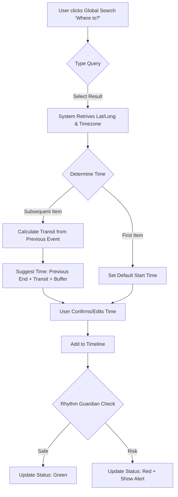
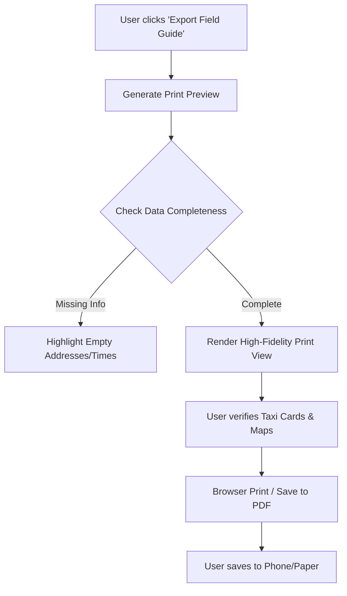
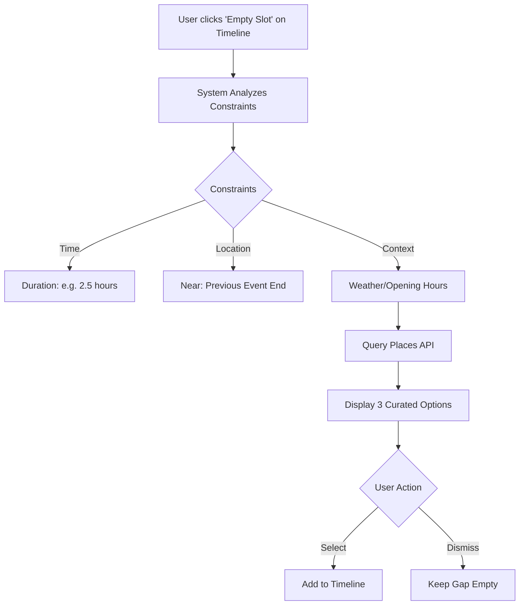

## Executive Summary

### Project Vision

traccia is a **Constraint-Based Travel Orchestrator** designed to solve "Stitching Fatigue"—the exhaustion caused by manually connecting logistics with discovery.

While competitors focus on maximizing *content* (places to go), traccia focuses on optimizing *continuity* (the flow between them). It is the first travel tool to treat **User Energy** and **Cognitive Load** as finite resources. By fusing intelligent gap-filling algorithms, burnout prevention logic, and military-grade offline redundancies, it serves the traveler who demands certainty and efficiency.

### Target Users

*   **Sarah, The "Anxious Planner" (Primary):** The trip architect. She views travel as a high-stakes investment and demands control. She fears the "Domino Effect" where one slip-up ruins the day. She relies on the **Survival Export** for psychological safety.
*   **David, The "Pragmatic Maximizer" (Primary):** The solo explorer. He is time-poor and hates "dead time." He uses the **Opportunity Filler** to find high-quality activities that fit exactly into his schedule gaps.
*   **Ben, The "Reluctant Companion" (Secondary):** The passive traveler. He consumes the itinerary via read-only links or the printed export.

### Key Design Challenges

*   **Visualizing "Invisible" Friction:** We must visualize abstract concepts like "Transit Buffers" and "Burnout Risk" (Rhythm Guardian) in a way that is helpful, not stressful. It shouldn't look like a system error, but a helpful nudge.
*   **Trust in "Black Box" Suggestions:** When the "Opportunity Filler" suggests a spot, the UI must explicitly state *why* it was chosen (e.g., "Fits your 2.5h gap & location") to build trust with the Pragmatic Maximizer.
*   **The "Offline" UI:** Designing the **Survival Export** (PDF) requires a shift from "screen design" to "print design." Legibility, contrast, and information density on A4 paper are critical UX constraints.
*   **Manual Entry Efficiency:** As an MVP without email parsing, the manual event entry form must be exceptionally frictionless to prevent user drop-off during onboarding.

### Design Opportunities

*   **The "Green Timeline" Reward:** Use positive reinforcement (visual cues like turning the timeline green) when a schedule becomes "realistic" and safe, giving the Anxious Planner a dopamine hit of relief.
*   **Serendipity as a Service:** Frame the "Opportunity Filler" suggestions not just as a list, but as a "curated loop" that feels like a local secret, enhancing the emotional value for the Maximizer.
*   **The "Tactical Artifact":** Elevate the PDF export from a boring list to a beautiful, branded "Field Guide" that users are proud to carry, increasing brand affinity even when offline.

## Core User Experience

### Defining Experience
The heartbeat of traccia is the **"Search -> Time -> Slot"** loop. The user builds their itinerary by searching for a real-world location (leveraging familiar Google Maps patterns), defining a time constraint, and seeing it instantly visualize within their linear day. This "skeleton building" phase must be frictionless to prevent early abandonment.

### Platform Strategy
*   **Primary Context:** Desktop Web. A "Command Center" view for deep work sessions, utilizing screen real estate to show the Timeline and Map simultaneously.
*   **Secondary Context:** Mobile Web. A "Field Companion" view. Focused on *reference* (checking the plan) and *quick capture* (adding a sudden stop). Advanced editing tools are hidden to preserve focus.
*   **Technical Constraint:** As a responsive Web App (HTMX), interaction patterns must rely on explicit clicks/taps rather than complex native gestures (swipes).

### Effortless Interactions
*   **Autofill Everything:** Users should never type an address. "Search > Select" populates Location, Lat/Long, and Timezone data instantly.
*   **Power-User Bypass:** For locations missing from standard maps (e.g., a specific trailhead), allow direct Lat/Long input.
*   **Automatic Connectivity:** The moment an event is placed, the system *effortlessly* calculates and draws the connection (transit time/distance) to adjacent events. The user connects nothing manually.

### Critical Success Moments
*   **The "Connectivity Snap":** The instant a second event is added, the "void" between them is filled with calculated travel data. This proves the system's intelligence immediately.
*   **The "Safety Export":** The physical act of holding the printed Survival Guide (or saving the PDF). This transitions the user from "Digital Anxiety" to "Analog Security."

### Experience Principles
1.  **Ingestion over Invention:** Make it easier to import reality (search results) than to type manual data.
2.  **Explicit Time:** In MVP, the user drives the clock. The system acts as the "Editor," not the "Author," validating the feasibility of the user's choices.
3.  **One Timeline, One Truth:** Avoid fragmented views. Logistics, activities, and gaps all live on a single, continuous vertical stream.

## Desired Emotional Response

### Primary Emotional Goals
*   **Certainty (The North Star):** The primary goal is to replace "Travel Anxiety" with "Logistical Certainty." The user must trust the system's math (time/distance) implicitly.
*   **Quiet Competence:** The product should feel like a reliable tool, not a needy assistant. It does not demand attention; it supports action.
*   **Invisibility:** The ultimate success is when the user forgets the app and enjoys the trip. The interface strives to be "unnoticed" by minimizing errors and friction.

### Emotional Journey Mapping
*   **Onboarding:** *Skepticism* -> *Validation*. The user tests the tool (e.g., adding two events). The system calculates the transit perfectly. Skepticism turns to trust.
*   **Planning:** *Overwhelm* -> *Clarity*. As the timeline fills, the "Risk Flags" guide the user to a realistic schedule. The feeling is one of "solving a puzzle."
*   **Execution (In-Trip):** *Flow*. The user glances at the app/printout, knows exactly where to go, and pockets it. No frustration, no "loading..." spinners, no confusion.

### Micro-Emotions
*   **Relief:** The specific feeling when a "Risk Warning" disappears after adjusting a time.
*   **Safety:** The tactile feeling of holding the printed "Survival Export."
*   **Control:** The user inputs the time; the system validates it. The user feels like the pilot; the system is the co-pilot.

### Design Implications
*   **Anti-Magic UI:** Avoid "magical" animations that obscure what's happening. Use snappy, direct transitions.
*   **Calm Aesthetics:** Use a muted, high-legibility color palette. "Alert Colors" (Red/Orange) are reserved strictly for actual logistical risks to maintain their semantic power.
*   **Information Density:** High density is acceptable if it increases clarity (e.g., showing terminal numbers, confirmation codes). Do not hide critical data behind "Show More" clicks for the sake of "cleanliness."

### Emotional Design Principles
1.  **Function is the Aesthetic:** A tool that works perfectly is beautiful. Prioritize utility and speed above decoration.
2.  **No False Positives:** Never alarm the user unnecessarily. "Risk Flags" must be accurate.
3.  **Respect the User's Focus:** The user is here to plan a trip, not to be entertained. Eliminate all distractions.

## UX Pattern Analysis & Inspiration

### Inspiring Products Analysis

*   **Uber (The Interaction Model):**
    *   *Core Strength:* Reduces complex logistics to a single question: "Where to?"
    *   *Key Lesson:* The interface is subservient to the map. The map is the territory; the UI is just the control panel.
    *   *Relevance:* Our "Search" bar should be the "Uber Button"—the start of every action.

*   **Wanderlog (The Visual Context):**
    *   *Core Strength:* Tight coupling between "List" and "Map." Hovering one highlights the other.
    *   *Key Lesson:* Users need to see "Where" and "What" simultaneously to make decisions.
    *   *Relevance:* We will adopt the "Pin-to-Card" highlight interaction to help users understand the geography of their day.

*   **Google Calendar (The Temporal Logic):**
    *   *Core Strength:* Unforgiving visualization of time. Overlaps look wrong; gaps look empty.
    *   *Key Lesson:* Visual space = Time. This is the most honest way to prevent over-scheduling.
    *   *Relevance:* Our timeline will use vertical height to represent duration, making "busy days" look physically long/dense.

### Transferable UX Patterns

*   **The "Intent-First" Search (Uber):**
    *   Start with "Where are you going?" immediately. Don't ask for dates/times until the user has defined the *place*.
    *   *Application:* The primary UI element is a persistent, high-contrast Search Bar.

*   **The "Frozen Map" Confirmation (Uber):**
    *   When selecting a location, the map zooms and "locks" to show exactly where the pin drops.
    *   *Application:* When a user selects a search result, the map view snaps to that location for visual verification before adding it to the timeline.

*   **The "Ghost Block" (Google Calendar):**
    *   Clicking an empty space creates a temporary "draft" event.
    *   *Application:* Clicking a gap in the timeline should propose a "Gap Filler" search or a manual entry for that specific timeslot.

### Anti-Patterns to Avoid

*   **The "Content Firehose" (Wanderlog/TripAdvisor):**
    *   *Avoid:* Bombarding the user with "Top 10" lists, ads, and sponsored content.
    *   *Why:* It creates decision fatigue and anxiety. Our user wants to *edit*, not *browse*.

*   **The "Hidden Edit" (Generic Travel Apps):**
    *   *Avoid:* Burying "Edit Time" behind 3 clicks (Menu > Edit > Time > Save).
    *   *Why:* "Rescheduling" is a core loop. It must be drag-and-drop or single-click.

### Design Inspiration Strategy

*   **Adopt:** Uber's "Map-Centricity." The map is not a modal; it is the background canvas of the application.
*   **Adapt:** The vertical timeline. Unlike a calendar (which is a grid), ours is a single "Stream of Consciousness" that flows from morning to night, integrating travel times as distinct blocks.
*   **Avoid:** Any "Social" features. No "Share on Facebook," no "See what friends did." This is a private operational tool, not a social network.

## Design System Foundation

### 1.1 Design System Choice
We will utilize **Tailwind CSS** as the utility-first styling engine, augmented by a lightweight, semantic component library like **DaisyUI** (or similar CSS-focused library) to ensure compatibility with the HTMX/Alpine.js stack.

### Rationale for Selection
*   **Tech Stack Alignment:** Tailwind's utility classes work seamlessly with HTMX's server-side rendering model, avoiding the need for complex JavaScript-based styling solutions (CSS-in-JS) that add client-side bloat.
*   **"Invisible" Aesthetics:** Tailwind allows for granular control over spacing, typography, and layout, enabling the "Quiet Competence" and custom "Uber-like" minimalism we require, rather than looking like a generic Bootstrap site.
*   **Print-First Capability:** Tailwind's robust print modifiers (`print:hidden`, `print:block`) are essential for styling the high-fidelity "Survival Export" PDF without needing a separate CSS codebase.

### Implementation Approach
*   **Theme Configuration:** We will define a minimal `tailwind.config.js` with semantic colors (e.g., `bg-risk-high`, `text-safe`) to enforce the "Emotional Design" logic (Red = Risk, Green = Safe).
*   **Component Strategy:** We will build a small set of "Atomic" components (Button, Input, Card) and "Molecular" patterns (TimelineItem, SearchResult) to maintain consistency.

### Customization Strategy
*   **Typography:** Use a clean, neo-grotesque sans-serif (e.g., Inter or Geist) to mirror the "International Style" of airport signage—legible, neutral, and authoritative.
*   **Color Palette:** A strict "Signal System" palette.
    *   *Neutral:* Grays for structure (Timeline, Cards).
    *   *Functional:* Green (Safe/On Time), Amber (Warning/Tight Buffer), Red (Risk/Impossible).
    *   *Brand:* A subtle accent color for the "Brand" moments, but used sparingly.

## 2. Core User Experience

### 2.1 Defining Experience
The defining interaction is **"The Intent-First Capture."**
Unlike calendars (which ask "When?"), traccia starts with "Where?" The user searches for a place, and the system handles the temporal logistics. This shifts the mental load from "Scheduling" (hard) to "listing desires" (easy/fun).

### 2.2 User Mental Model
*   **Current State:** Users have a "Bucket List" in their head (or Notes app) and a "Schedule" in their calendar. Bridging them is manual work.
*   **Our Model:** "I want to go *here*." -> System: "Okay, it fits *here*."
*   **Key Shift:** The user provides the *content* (Place); the system provides the *container* (Time/Logistics).

### 2.3 Success Criteria
*   **Speed:** Search-to-Slot time < 5 seconds.
*   **Confidence:** The user never wonders "Did I get the address right?" because it came from the map.
*   **Connectivity:** The user never manually calculates "How long to get there?" The system answers that instantly upon addition.

### 2.4 Novel UX Patterns
*   **The "Floating Search" (Adopted from Uber):** A persistent, high-prominence search bar that is never hidden. It anchors the screen.
*   **The "Auto-Slotting" Logic:** When a user selects a place, the system defaults the time to "Immediately following the last event + Transit Time," creating a "rolling itinerary" that builds itself.

### 2.5 Experience Mechanics
*   **1. Initiation:** User clicks/taps the global "Where to?" search bar. No mode switching needed.
*   **2. Interaction:** User types "Louvre" -> Selects result. Map flies to location.
*   **3. Temporal Assignment:** System presents a "Quick Add" modal with a calculated default time (e.g., "Arrive at 14:30 (after Lunch)"). User can accept or override.
*   **4. Feedback (The Snap):** The event "snaps" into the timeline. The "Transit Ribbon" (connecting line) draws itself between the previous event and the new one, displaying travel mode/time.
*   **5. Completion:** Timeline status indicator updates (Green/Amber/Red).

## Visual Design Foundation

### Color System
*   **Palette Concept:** "Airport Minimal." A neutral, high-contrast base with strict semantic signaling.
*   **Neutrals:**
    *   `bg-canvas`: `slate-50` (App background - reduces eye strain vs pure white).
    *   `bg-surface`: `white` (Cards/Panels - creates depth).
    *   `text-primary`: `slate-900` (Max contrast).
    *   `text-secondary`: `slate-500` (Metadata/Labels).
*   **Semantic Signals (The "Rhythm Guardian"):**
    *   `signal-safe`: `emerald-600` (Valid connections).
    *   `signal-risk`: `rose-600` (Impossible connections).
    *   `signal-warn`: `amber-500` (Tight buffers).
    *   `brand-primary`: `indigo-600` (Actions/Buttons - distinct from status signals).

### Typography System
*   **Typeface:** **Inter** (Google Fonts/Tailwind default).
*   **Rationale:** Highest legibility at small sizes; "International Style" neutrality aligns with the "Tool" persona.
*   **Features:** **Tabular Numerals** (`font-variant-numeric: tabular-nums`) are MANDATORY for all time/duration displays to ensuring vertical alignment in the timeline.
*   **Scale:** 
    *   `text-xs` (Map labels).
    *   `text-sm` (Timeline details).
    *   `text-base` (Body/Inputs).
    *   `text-lg` (Section headers).
    *   `text-2xl` (Trip Titles - rarely used).

### Spacing & Layout Foundation
*   **Base Unit:** 4px (Tailwind standard).
*   **Timeline Density:**
    *   **Vertical Rhythm:** 1 hour = 64px height (visual proxy for time).
    *   **Card Padding:** `p-3` (12px) for items to maximize data density.
*   **Layout Structure:**
    *   **Desktop:** Split View. Fixed Left Sidebar (Timeline) 400px + Fluid Right Pane (Map).
    *   **Mobile:** Single Column. Stacked Cards. Map accessible via toggle or bottom sheet.

### Accessibility Considerations
*   **Contrast:** All `text-secondary` must meet AA (4.5:1) against `bg-surface`.
*   **Color Blindness:** "Risk" states must not rely on color alone. We will use Icons (⚠️) alongside Red colors for status.
*   **Print:** A dedicated `@media print` stylesheet will force black-on-white high contrast and remove all background fills for ink preservation.

## Design Direction Decision

### Design Directions Explored
We explored four distinct directions:
1.  **Split View:** Classic SaaS dashboard. Efficient but generic.
2.  **Map First:** Uber-like. Good for "Now," bad for "Planning."
3.  **Notebook:** Notion-like. Too passive/editorial.
4.  **Swiss/Brutalist:** High-contrast, typographic, authoritative.

### Chosen Direction
**Direction 4: "Swiss / Brutalist Field Guide"**

We will adopt the **Swiss Style (International Typographic Style)** aesthetic.
*   **Key Characteristics:** High contrast, dominance of typography, strict grid systems, and distinct "Safety" colors (Yellow/Black/Red).
*   **Map Behavior:** The Map is *secondary* to the Timeline. It is accessed on demand ("Just-in-Time" context) rather than competing for attention permanently.

### Design Rationale
*   **Authority & Trust:** The Brutalist aesthetic conveys "This is a tool, not a toy." It feels engineered, not just designed. This builds confidence for the "Anxious Planner."
*   **Legibility:** Large type and high contrast make it readable in sunlight or stress.
*   **Focus:** Hiding the map prevents "Map Fatigue." The user focuses on the logic of the schedule first, checking geography only when necessary.
*   **Differentiation:** It stands out immediately against the sea of "Blue/Rounded/Soft" travel apps (TripAdvisor, etc.).

### Implementation Approach
*   **Borders:** Thick, distinct borders (`border-2 border-black`) define content areas clearly.
*   **Shadows:** Hard shadows (`box-shadow: 4px 4px 0px 0px black`) replace soft drop shadows, giving a tactile, "card stock" feel.
*   **Typography:** Uppercase headers for metadata (time, platform). Large, bold serif or sans-serif for Place Names to act as landmarks.

## User Journey Flows

### Journey 1: The Creation Loop (Search & Add)
This is the primary input mechanism. It must handle the transition from "Intent" (Search) to "Reality" (Timeline Logistics).

### Journey 2: The Safety Net (Export)
The transition from "Digital Planning" to "Analog Security."

### Journey 3: The Gap Fill (Opportunity)
The discovery loop for filling "Dead Time" with quality experiences.

### Journey Patterns
*   **"Draft & Commit":** The system proposes a time/route (Draft), and the user validates it (Commit). We never auto-commit without a chance to review.
*   **"Visual Validation":** Every data entry action results in an immediate visual change on the Timeline (Green/Red line), providing instant feedback loops.

### Flow Optimization Principles
*   **Default to "Next":** Always assume the user wants to go to the *next* logical step (e.g., after adding a hotel, suggest "Add Dinner nearby?").
*   **Error Prevention:** Disable the "Export" button if critical data (like addresses) is missing, guiding the user to fix it first.

## Component Strategy

### Design System Components (DaisyUI/Tailwind)
We will leverage standard components for administrative actions to save time:
*   **Buttons:** Primary (Black), Secondary (White w/ Border), Ghost (Text only).
*   **Inputs:** Text fields, Time pickers (native browser), Checkboxes.
*   **Modals:** For the "Quick Add" confirmation.
*   **Toasts:** For system feedback ("Saved", "Error").

### Custom Components

#### 1. TimelineStream (The Spine)
*   **Purpose:** The visual connector between events that represents "The Journey."
*   **Anatomy:** A vertical line (`border-l-2`) with distinct markers for Start/End points.
*   **States:**
    *   *Default:* Gray dashed line (Standard transit).
    *   *Risk:* Red dotted line (Impossible connection).
    *   *Gap:* Empty space with "Add" hover state.

#### 2. SwissCard (The Event)
*   **Purpose:** Display event details with maximum legibility and hierarchy.
*   **Anatomy:**
    *   Container: White, `border-2 border-black`, `shadow-[4px_4px_0_black]`.
    *   Header: Uppercase Title (Place Name).
    *   Metadata: Monospace time aligned right.
*   **Variants:**
    *   *Standard:* Normal event.
    *   *Compact:* For short durations (<30 mins).
    *   *Expanded:* Shows notes/booking codes.

#### 3. SignalBadge (The Status)
*   **Purpose:** Communicate logistical validity without words.
*   **Anatomy:** Icon + Label combo.
*   **Variants:**
    *   `Safe`: Green bg + Check icon.
    *   `Risk`: Red bg + Exclamation icon.
    *   `Warn`: Amber bg + Triangle icon.

#### 4. TaxiCard (The Print Item)
*   **Purpose:** A physical tool for communication in foreign countries.
*   **Anatomy:**
    *   Top: English Name (Small).
    *   Center: Local Name (Huge, Serif).
    *   Bottom: Address (Medium).
*   **Print Specifics:** High contrast black/white only. No backgrounds.

### Component Implementation Strategy
*   **Atomic Design:** We will build `TimelineStream` and `SwissCard` as "Molecules" composed of atomic Tailwind classes.
*   **HTMX Integration:** Components will be designed as server-side templates (Go templates) that accept data and render HTML, rather than client-side React components.
*   **Print Media Queries:** The `TaxiCard` will have `print:block` and `hidden` classes to ensure it only appears on the physical paper, not the screen.

### Implementation Roadmap
*   **Phase 1 (MVP Critical):** `TimelineStream`, `SwissCard`, `SignalBadge`. (Required for the Core Loop).
*   **Phase 2 (Safety Net):** `TaxiCard` and `PrintLayout`. (Required for Export).
*   **Phase 3 (Polishing):** `GapFiller` card (for suggestions) and `MapPin` (custom map markers).

## UX Consistency Patterns

### Feedback Patterns
*   **Inline Structural Alerts:** Critical warnings (e.g., "Impossible Connection") are not transient. They are injected into the DOM as `bg-red-50 border-l-4 border-red-600` blocks *between* the conflicting events. They persist until resolved.
*   **Status Indicators:** Every event card has a "Status Pill" (Safe/Risk) in the top right. This provides a "Health Check" at a glance.

### Navigation Patterns
*   **The "Mode Switch":** A persistent top-bar toggle: `[ PLAN ] [ MAP ] [ PRINT ]`. This effectively switches the "View Mode" of the same data rather than navigating to different pages.
*   **Browser Back:** Because we use HTMX, the back button should respect state changes (e.g., closing an accordion or switching tabs), ensuring the browser history matches user intent.

### Interaction Patterns
*   **Accordion Editing:** clicking an event card expands it to reveal the "Edit Form" (Time/Notes). This preserves the context of surrounding events while editing, which is critical for time-based decisions.
*   **"Ghost" Hover:** Hovering a gap in the timeline reveals a "Ghost Slot" with a `+ Add` button, teaching the user that gaps are interactive opportunities, not just empty space.

### Empty States
*   **The "First Step" Prompt:** When the timeline is empty, we don't just show "No events." We show a "Starter Template" or a prominent search bar with "Where does your trip start?" to reduce blank page paralysis.

## Responsive Design & Accessibility

### Responsive Strategy
*   **Desktop (Command Center):** Split view. Left pane (400px fixed) for the "Manifest" (Timeline). Right pane (Fluid) for the "Context" (Map).
*   **Mobile (Field Companion):** Single column. The "Manifest" is the default view. The Map is hidden behind a persistent floating action button (FAB) or bottom bar toggle.
    *   *Rationale:* On mobile, screen real estate is too valuable to split. Users are typically in "Execution Mode" (Checking the list) or "Wayfinding Mode" (Checking the map), rarely both simultaneously.

### Breakpoint Strategy
*   **Mobile (<768px):** Single column. Stacked layout. Map is secondary.
*   **Tablet/Desktop (≥768px):** Split view activates. Map becomes a permanent neighbor.

### Accessibility Strategy
*   **Semantic Signals:** "Risk" states (Red) and "Safe" states (Green) MUST be accompanied by icons (⚠️ / ✅) to support color-blind users (Deuteranopia/Protanopia).
*   **Keyboard Navigation:** The timeline is a sequential list. Users must be able to `Tab` through events and press `Enter` to expand/edit details without a mouse.
*   **Touch Targets:** All interactive elements (especially "Add" buttons and "Edit" toggles) must meet the 44x44px minimum for reliable touch interaction while walking.

### Testing Strategy
*   **High Contrast Mode:** Verify that the "Swiss" aesthetic remains legible when OS-level High Contrast modes are active.
*   **Zoom:** Interface must support 200% text zoom without breaking the vertical timeline alignment.

### Implementation Guidelines
*   **Media Queries:** Use Tailwind's `md:` prefix to toggle the layout (e.g., `grid-cols-1 md:grid-cols-[400px_1fr]`).
*   **Aria Labels:** All icon-only buttons (like the "Risk" icon) must have `aria-label="Risk Warning"` for screen readers.
